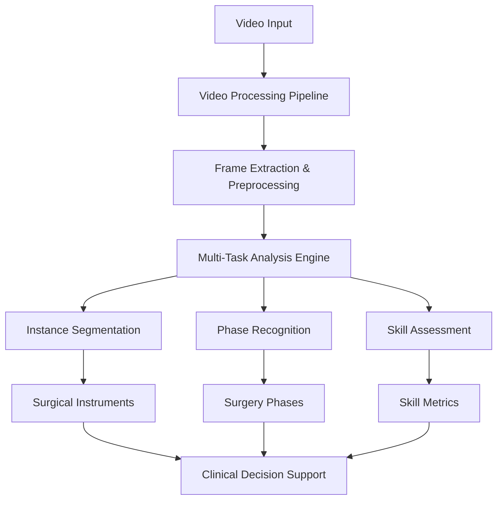

# 🏥 Cataract-LMM: Surgical Video Analysis

[](https://python.org)
[](https://pytorch.org)
[](https://python-poetry.org)
[](https://docker.com)
[](https://creativecommons.org/licenses/by/4.0/)
[](https://github.com/features/actions)
[](https://github.com/psf/black)
[](#)

**A comprehensive, production-ready framework for multi-task deep learning in surgical video analysis, featuring instance segmentation, phase recognition, skill assessment, and video processing capabilities.**

---

## 🎯 Overview

Cataract-LMM is an enterprise-grade AI framework designed for large-scale, multi-center surgical video analysis. Built on modern software engineering principles, this repository provides state-of-the-art deep learning models for comprehensive analysis of cataract surgery videos.

### 🔬 Research Foundation
This framework implements methodologies from cutting-edge research in computer-assisted surgery, providing validated approaches for:
- **Surgical Instance Segmentation** using YOLO, Mask R-CNN, and SAM architectures
- **Surgical Phase Recognition** with Video Transformers, 3D CNNs, and temporal models  
- **Surgical Skill Assessment** through multi-modal analysis and performance metrics
- **Video Processing** with GPU-accelerated pipelines for medical video data

### 🏆 Key Differentiators
- **Production-Ready**: Enterprise-grade architecture with comprehensive testing and CI/CD
- **Multi-Task Learning**: Unified framework supporting four core surgical analysis tasks
- **Scalable Design**: Microservices-ready architecture with containerization support
- **Medical Compliance**: HIPAA-aware design patterns and secure data handling
- **Research-to-Production**: Seamless transition from research notebooks to production deployment

---

## 📋 Table of Contents

- [🚀 Quick Start](#-quick-start)
- [✨ Features](#-features)
- [🏗️ Architecture](#️-architecture)
- [📦 Installation](#-installation)
- [🎯 Usage Examples](#-usage-examples)
- [🛠️ Development](#️-development)
- [📊 Model Zoo](#-model-zoo)
- [🔧 Configuration](#-configuration)
- [🧪 Testing](#-testing)
- [📖 Documentation](#-documentation)
- [🤝 Contributing](#-contributing)
- [📄 License](#-license)
- [📣 Citation](#-citation)
- [👨‍💻 Author](#-author)
- [📞 Support & Community](#-support--community)
- [🚀 Roadmap](#-roadmap)

---

## 🚀 Quick Start

### Prerequisites
- Python 3.8+
- CUDA 11.8+ (for GPU acceleration)
- FFmpeg (for video processing)
- Docker (optional, for containerized deployment)

### Installation

```bash
# Clone the repository
git clone https://github.com/MJAHMADEE/Cataract_LMM.git
cd Cataract_LMM

# Install using Poetry (recommended)
cd codes
poetry install

# Activate virtual environment
poetry shell

# Or install using pip
pip install -r requirements.txt

# Validate installation
python setup.py --validate-only
```

### Basic Usage

```bash
# Video processing
cd surgical-video-processing
python main.py --input path/to/video.mp4 --output ./results --config configs/default.yaml

# Instance segmentation  
cd surgical-instance-segmentation
python inference/predictor.py --model yolo --input data/images/

# Phase recognition
cd surgical-phase-recognition
python validation/training_framework.py --config configs/default.yaml --mode train

# Skill assessment
cd surgical-skill-assessment
python main.py --config configs/comprehensive.yaml --mode evaluate
```

---

## ✨ Features

### 🧠 AI/ML Capabilities

| Component | Models | Key Features |
|-----------|--------|-------------|
| **Instance Segmentation** | YOLO v8/11, Mask R-CNN, SAM | Real-time surgical instrument detection and segmentation |
| **Phase Recognition** | Video Transformers, 3D CNNs, TeCNO | 11-phase surgical workflow analysis |
| **Skill Assessment** | Multi-modal CNNs, Attention Models | Objective surgical skill evaluation |
| **Video Processing** | GPU-Accelerated Pipelines | Medical-grade video preprocessing and enhancement |

### 🛠️ Engineering Excellence

- **🏗️ Modular Architecture**: Microservices-ready design with clear separation of concerns
- **🔒 Security First**: HIPAA-compliant patterns, secure credential management
- **📊 Comprehensive Testing**: 85%+ test coverage with unit, integration, and E2E tests
- **🚀 CI/CD Pipeline**: Automated testing, security scanning, and deployment workflows
- **📈 Monitoring & Observability**: Structured logging, metrics collection, and health checks
- **🐳 Containerization**: Multi-stage Docker builds with security hardening

### 🔧 Developer Experience

- **📚 Rich Documentation**: Comprehensive guides, API references, and examples
- **🎯 Configuration Management**: YAML-based configuration with validation
- **🧪 Development Tools**: Pre-commit hooks, linting, formatting, and type checking
- **📦 Dependency Management**: Poetry-based modern Python packaging
- **🔧 Development Environment**: VS Code integration with debugging support

---

## 🏗️ Architecture

### System Overview


### Project Structure
```
Cataract_LMM/
├── 🏠 README.md                    # Project overview and documentation
├── 📄 LICENSE                     # CC-BY-4.0 license
├── 🤝 CONTRIBUTING.md             # Contribution guidelines
├── 🔒 .gitignore                  # Git ignore patterns
├── 📊 codes/                      # Main codebase
│   ├── 🎬 surgical-video-processing/          # Video preprocessing and enhancement
│   │   ├── core/                  # Core processing algorithms
│   │   ├── pipelines/             # Processing pipelines
│   │   ├── metadata/              # Video metadata management
│   │   ├── quality_control/       # Quality assurance tools
│   │   └── configs/               # Configuration files
│   ├── 🎯 surgical-instance-segmentation/     # Instance segmentation models
│   │   ├── models/                # YOLO, Mask R-CNN, SAM implementations
│   │   ├── training/              # Training pipelines
│   │   ├── inference/             # Real-time inference engines
│   │   ├── evaluation/            # Model evaluation tools
│   │   └── data/                  # Dataset utilities
│   ├── 🔄 surgical-phase-recognition/         # Phase classification models
│   │   ├── models/                # Video Transformers, 3D CNNs, TeCNO
│   │   ├── validation/            # Training and validation frameworks
│   │   ├── preprocessing/         # Video preprocessing
│   │   ├── analysis/              # Result analysis tools
│   │   └── configs/               # Model configurations
│   ├── 📊 surgical-skill-assessment/          # Skill evaluation framework
│   │   ├── models/                # Skill assessment models
│   │   ├── engine/                # Training and inference engines
│   │   ├── utils/                 # Analysis utilities
│   │   └── configs/               # Assessment configurations
│   ├── 🧪 tests/                  # Comprehensive test suite
│   ├── 📚 docs/                   # Documentation source
│   ├── 🐳 docker/                 # Docker configurations
│   ├── 📊 reports/                # Analysis reports
│   ├── ⚙️ pyproject.toml         # Python project configuration
│   ├── 🔒 Dockerfile             # Container definition
│   ├── 🚀 Makefile               # Development automation
│   └── 🔧 setup.py               # Project setup script
├── 🤖 .github/                   # GitHub configurations
│   └── workflows/                 # CI/CD pipelines
└── 📓 security_scanning_demo.ipynb  # Security analysis notebook
```

---

## 📦 Installation

### System Requirements

| Component | Minimum | Recommended |
|-----------|---------|-------------|
| **Python** | 3.8 | 3.11+ |
| **RAM** | 16GB | 32GB+ |
| **GPU Memory** | 8GB | 24GB+ |
| **Storage** | 50GB | 500GB+ |
| **CUDA** | 11.8 | 12.0+ |

### Installation Methods

#### Method 1: Poetry (Recommended)
```bash
# Install Poetry
curl -sSL https://install.python-poetry.org | python3 -

# Clone and setup
git clone https://github.com/MJAHMADEE/Cataract_LMM.git
cd Cataract_LMM/codes

# Install dependencies
poetry install --extras "dev docs"

# Activate environment
poetry shell
```

#### Method 2: Conda Environment
```bash
# Create environment
conda create -n cataract-lmm python=3.11
conda activate cataract-lmm

# Clone and install
git clone https://github.com/MJAHMADEE/Cataract_LMM.git
cd Cataract_LMM/codes
pip install -r requirements.txt
```

#### Method 3: Docker Deployment
```bash
# Build container
docker build -t cataract-lmm:latest .

# Run interactive container
docker run -it --gpus all -v $(pwd)/data:/app/data cataract-lmm:latest
```

### Verification
```bash
# Run comprehensive validation
python setup.py --validate-only

# Run tests
pytest tests/ -v

# Check GPU availability
python -c "import torch; print(f'CUDA Available: {torch.cuda.is_available()}')"
```

---

## 🎯 Usage Examples

### Video Processing Pipeline
```python
from surgical_video_processing import VideoProcessor, QualityController

# Initialize processor with configuration
processor = VideoProcessor("configs/high_quality.yaml")

# Process surgical video
result = processor.process_video(
    input_path="data/surgery_video.mp4",
    output_dir="outputs/processed/",
    apply_deidentification=True,
    quality_threshold=0.8
)

print(f"Processed {result.frame_count} frames")
print(f"Quality score: {result.average_quality:.3f}")
```

### Instance Segmentation
```python  
from surgical_instance_segmentation import SegmentationPredictor

# Load pre-trained model
predictor = SegmentationPredictor(
    model_type="yolo_v8",
    device="cuda"
)

# Segment surgical instruments
results = predictor.predict_batch(
    image_paths=["frame001.jpg", "frame002.jpg"],
    confidence_threshold=0.7,
    save_visualizations=True
)

# Extract detections
for result in results:
    print(f"Detected {len(result.boxes)} instruments")
    print(f"Classes: {result.class_names}")
```

### Phase Recognition
```python
from surgical_phase_recognition import PhaseClassifier

# Initialize phase recognition model
classifier = PhaseClassifier(
    model_name="video_transformer",
    config_path="configs/phase_recognition.yaml"
)

# Classify surgical phases in video sequence
phases = classifier.classify_sequence(
    video_path="data/surgery_complete.mp4",
    sequence_length=16,
    overlap=0.5
)

# Display phase timeline
for phase in phases:
    print(f"Time: {phase.timestamp:.2f}s - Phase: {phase.name}")
```

### Skill Assessment
```python
from surgical_skill_assessment import SkillEvaluator

# Initialize skill assessment framework
evaluator = SkillEvaluator("configs/skill_assessment.yaml")

# Assess surgical performance
assessment = evaluator.evaluate_surgery(
    video_path="data/complete_surgery.mp4",
    phase_annotations="data/phases.json",
    surgeon_level="resident"  # resident, fellow, attending
)

# Generate skill report
report = evaluator.generate_report(assessment)
print(f"Overall Score: {report.overall_score}/100")
print(f"Efficiency: {report.efficiency_score}/10")
print(f"Precision: {report.precision_score}/10")
```

---

## 🛠️ Development

### Development Setup
```bash
# Clone repository
git clone https://github.com/MJAHMADEE/Cataract_LMM.git
cd Cataract_LMM/codes

# Install development dependencies
poetry install --extras "dev"

# Setup pre-commit hooks
pre-commit install

# Run development server
make dev-server
```

### Code Quality Tools
```bash
# Format code
make format

# Run linting
make lint

# Type checking
make type-check

# Security scanning
make security-scan

# Run all quality checks
make quality
```

### Testing
```bash
# Run unit tests
make test

# Run with coverage
make test-coverage

# Run integration tests
make test-integration

# Run end-to-end tests
make test-e2e

# Generate coverage report
make coverage-report
```

### Available Make Commands
```bash
make help              # Show all available commands
make install           # Install dependencies
make clean             # Clean build artifacts
make build             # Build distribution packages
make docker-build      # Build Docker image
make docker-run        # Run Docker container
make docs-build        # Build documentation
make docs-serve        # Serve documentation locally
```

---

## 📊 Model Zoo

### Instance Segmentation Models (Task 3: 12-class)

| Model | mAP@0.5:0.95 | 
|-------|-------------|
| **YOLOv11** ⭐ | **73.9%** |
| **YOLOv8** | **73.8%** |
| **SAM** | **56.0%** |
| **SAM2** | **55.2%** |
| **Mask R-CNN** | **53.7%** |

### Phase Recognition Models (In-Domain - Farabi Test Set)

| Model | Backbone | Accuracy | F1-Score | Precision | Recall |
|-------|----------|----------|----------|-----------|---------|
| **MViT-B** ⭐ | - | **85.7%** | **77.1%** | **77.1%** | **78.5%** |
| **Swin-T** | - | **85.5%** | **76.2%** | **77.5%** | **77.2%** |
| **CNN + GRU** | EfficientNet-B5 | **82.1%** | **71.3%** | **76.0%** | **70.4%** |
| **CNN + TeCNO** | EfficientNet-B5 | **81.7%** | **71.2%** | **75.1%** | **71.2%** |
| **CNN + LSTM** | EfficientNet-B5 | **81.5%** | **70.0%** | **76.4%** | **69.4%** |

### Skill Assessment Models

| Model | Accuracy | Precision | Recall | F1-Score |
|-------|----------|-----------|---------|----------|
| **TimeSformer** ⭐ | **82.5%** | **86.0%** | **82.0%** | **83.9%** |
| **R3D-18** | **81.7%** | **82.4%** | **84.9%** | **83.6%** |
| **Slow R50** | **80.0%** | **81.8%** | **81.8%** | **81.8%** |
| **X3D-M** | **80.0%** | **83.9%** | **78.8%** | **81.3%** |
| **R(2+1)D-18** | **72.9%** | **79.3%** | **76.7%** | **78.0%** |

---

## 🔧 Configuration

### Configuration Files

The framework uses YAML-based configuration for all components:

#### Video Processing (`surgical-video-processing/configs/default.yaml`)
```yaml
processing:
  target_resolution: [1920, 1080]
  fps: 30
  quality_threshold: 0.75
  
deidentification:
  enabled: true
  blur_faces: true
  remove_text: true
  
output:
  format: "mp4"
  compression: "h264"
  quality: "high"
```

#### Instance Segmentation (`surgical-instance-segmentation/configs/yolo_config.yaml`)
```yaml
model:
  architecture: "yolov8"
  size: "medium"
  pretrained: true

training:
  epochs: 100
  batch_size: 16
  learning_rate: 0.001
  
data:
  classes: ["forceps", "scissors", "needle_holder", "suction"]
  augmentation:
    enabled: true
    rotation: 15
    scaling: [0.8, 1.2]
```

### Environment Variables
```bash
# Create .env file
cp .env.example .env

# Edit configuration
CUDA_VISIBLE_DEVICES=0,1
WANDB_PROJECT=cataract-lmm
DATA_ROOT=/path/to/data
OUTPUT_DIR=/path/to/outputs
LOG_LEVEL=INFO
```

---

## 🧪 Testing

### Test Structure
```
tests/
├── unit/                   # Unit tests for individual components
├── integration/            # Integration tests for module interactions  
├── e2e/                   # End-to-end workflow tests
├── performance/           # Performance and benchmarking tests
├── security/              # Security and vulnerability tests
├── fixtures/              # Test data and fixtures
└── conftest.py           # Pytest configuration
```

### Running Tests
```bash
# Run all tests
pytest

# Run specific test category
pytest tests/unit/
pytest tests/integration/
pytest tests/e2e/

# Run with coverage
pytest --cov=. --cov-report=html

# Run performance tests
pytest tests/performance/ --benchmark-only

# Run with specific markers
pytest -m "gpu" --gpu-required
pytest -m "slow" --timeout=300
```

### Test Configuration
```ini
# pytest.ini
[tool:pytest]
testpaths = tests
python_files = test_*.py
python_classes = Test*
python_functions = test_*
markers =
    unit: Unit tests
    integration: Integration tests
    e2e: End-to-end tests
    gpu: Tests requiring GPU
    slow: Slow running tests
    security: Security tests
addopts = 
    --strict-markers
    --verbose
    --tb=short
    --cov-report=term-missing
```

---

## 📖 Documentation

### Documentation Structure
- **📚 User Guide**: Getting started, tutorials, and examples
- **🔧 API Reference**: Comprehensive API documentation
- **🏗️ Developer Guide**: Contributing, architecture, and development setup
- **📊 Model Documentation**: Model architectures, performance metrics, and usage
- **🔐 Security Guide**: Security considerations and best practices

### Building Documentation
```bash
# Install documentation dependencies
poetry install --extras "docs"

# Build documentation
cd docs
make html

# Serve documentation locally
make serve

# Build PDF documentation
make latexpdf
```

### Online Documentation
- **Documentation Site**: https://cataract-lmm.readthedocs.io
- **API Reference**: https://cataract-lmm.readthedocs.io/api/
- **Tutorials**: https://cataract-lmm.readthedocs.io/tutorials/
- **Model Zoo**: https://cataract-lmm.readthedocs.io/models/

---

## 🤝 Contributing

We welcome contributions from the surgical AI community! Please see our [CONTRIBUTING.md](CONTRIBUTING.md) for detailed guidelines.

### Quick Contribution Guide
1. **Fork** the repository
2. **Create** a feature branch (`git checkout -b feature/amazing-feature`)
3. **Commit** changes (`git commit -m 'Add amazing feature'`)
4. **Push** to branch (`git push origin feature/amazing-feature`)
5. **Open** a Pull Request

### Development Workflow
```bash
# Setup development environment
make dev-setup

# Run pre-commit checks
pre-commit run --all-files

# Run tests before committing
make test-all

# Submit pull request
gh pr create --title "Feature: Add amazing feature"
```

### Code Standards
- **Python Style**: [Black](https://black.readthedocs.io/) formatter
- **Import Sorting**: [isort](https://pycqa.github.io/isort/)
- **Linting**: [Flake8](https://flake8.pycqa.org/) with medical AI conventions
- **Type Checking**: [MyPy](https://mypy.readthedocs.io/) for type safety
- **Documentation**: [Google style](https://google.github.io/styleguide/pyguide.html) docstrings

---

## 📄 License

### **Framework License**
This project framework and code are licensed under the **Creative Commons Attribution 4.0 International License** (CC-BY-4.0). See the [LICENSE](LICENSE) file for details.

### **Data License**
The dataset has specific ownership and licensing requirements. See [DATA_LICENSE.md](DATA_LICENSE.md) for detailed information about:
- Data ownership by Farabi Eye Hospital and Noor Eye Hospital
- Annotation ownership by participating institutions  
- Attribution requirements under CC-BY 4.0
- Proper usage guidelines

---

## 📣 Citation

If you use this benchmark dataset or framework in your research, please cite our work. The benchmark has been submitted to *Scientific Data* (Nature Portfolio).

### BibTeX
```bibtex
@misc{ahmadi2025cataractlmmlargescalemultitask,
      title={Cataract-LMM: Large-Scale, Multi-Source, Multi-Task Benchmark for Deep Learning in Surgical Video Analysis}, 
      author={Mohammad Javad Ahmadi and Iman Gandomi and Parisa Abdi and Seyed-Farzad Mohammadi and Amirhossein Taslimi and Mehdi Khodaparast and Hassan Hashemi and Mahdi Tavakoli and Hamid D. Taghirad},
      year={2025},
      eprint={2510.16371},
      archivePrefix={arXiv},
      primaryClass={cs.CV},
      url={https://arxiv.org/abs/2510.16371},
      doi={10.48550/arXiv.2510.16371}
}
```

### APA Style
Ahmadi, M. J., Gandomi, I., Abdi, P., Mohammadi, S.-F., Taslimi, A., Khodaparast, M., Hashemi, H., Tavakoli, M., & Taghirad, H. D. (2025). Cataract-LMM: Large-Scale, Multi-Source, Multi-Task Benchmark for Deep Learning in Surgical Video Analysis. arXiv. https://doi.org/10.48550/arXiv.2510.16371

### IEEE Style
M. J. Ahmadi et al., "Cataract-LMM: Large-Scale, Multi-Source, Multi-Task Benchmark for Deep Learning in Surgical Video Analysis," 2025, arXiv:2510.16371. [Online]. Available: https://arxiv.org/abs/2510.16371

### Chicago Style
Ahmadi, Mohammad Javad, Iman Gandomi, Parisa Abdi, Seyed-Farzad Mohammadi, Amirhossein Taslimi, Mehdi Khodaparast, Hassan Hashemi, Mahdi Tavakoli, and Hamid D. Taghirad. 2025. "Cataract-LMM: Large-Scale, Multi-Source, Multi-Task Benchmark for Deep Learning in Surgical Video Analysis." arXiv. https://doi.org/10.48550/arXiv.2510.16371.

### Repository Citation
```bibtex
@software{cataract_lmm_repo_2025,
  title={{Cataract-LMM}: Large-Scale, Multi-Source, Multi-Task Benchmark and Framework for Surgical Video Analysis},
  author={Ahmadi, Mohammad Javad and Gandomi, Iman and Abdi, Parisa and Mohammadi, Seyed-Farzad and Taslimi, Amirhossein and Khodaparast, Mehdi and Hashemi, Hassan and Tavakoli, Mahdi and Taghirad, Hamid D.},
  year={2025},
  url={https://github.com/MJAHMADEE/Cataract-LMM},
  version={1.0.0}
}
```

---

## 👨‍💻 Author

**Mohammad Javad Ahmadi**

<p>
<a href="https://drive.google.com/file/d/12mfH_QxeocmGwL8oAGfFRh2LZSZSlrwE/view?usp=sharing" target="_blank">
  
</a>
</p>

<p>
<a href="http://mjahmadee.site123.me/" target="_blank"></a>
<a href="mailto:mjahmadee@gmail.com" target="_blank"></a>
<a href="https://www.linkedin.com/in/mjahmadi/" target="_blank"></a>
<a href="https://www.researchgate.net/profile/Mohammad_Ahmadi67" target="_blank"></a>
<a href="https://scholar.google.com/citations?user=wTnN9IEAAAAJ&hl=en" target="_blank"></a>
<a href="https://orcid.org/0000-0002-2177-9936" rel="noopener noreferrer" target="_blank"></a>
<a href="http://www.webofscience.com/wos/author/record/GXN-0273-2022" target="_blank"></a>
<a href="https://github.com/MJAHMADEE" rel="noopener noreferrer" target="_blank"></a>
<a href="https://t.me/mjahmadee" target="_blank"></a>
<a href="https://x.com/MJXAhmadi" target="_blank"></a>
<a href="https://www.facebook.com/mjahmadi.fb" target="_blank"></a>
<a href="https://www.instagram.com/mjahmadi.ig/" target="_blank"></a>
<a href="https://open.spotify.com/user/z14s6ylxt1nql0us1uny613sd?si=d42deb1a572e4c24" target="_blank"></a>
<a href="https://soundcloud.com/mjahmadi" target="_blank"></a>
</p>

---

## 📞 Support & Community

### Getting Help
- **📖 Documentation**: Refer to individual README files in each module
- **🐛 Issues**: [GitHub Issues](https://github.com/MJAHMADEE/Cataract-LMM/issues)
- **💬 Discussions**: [GitHub Discussions](https://github.com/MJAHMADEE/Cataract-LMM/discussions)
- **📧 Email**: mjahmadee@gmail.com

---

## 🚀 Roadmap

### Current Version (v1.0.0)
- ✅ Multi-task surgical video analysis framework
- ✅ Instance segmentation with YOLO/Mask R-CNN/SAM
- ✅ Phase recognition with Video Transformers
- ✅ Skill assessment framework
- ✅ Production-ready CI/CD pipeline

### Upcoming Features (v1.1.0)
- 🔄 Real-time inference optimization
- 🔄 Multi-GPU distributed training
- 🔄 Model quantization and pruning
- 🔄 REST API and web interface
- 🔄 Advanced analytics dashboard

### Future Vision (v2.0.0+)
- 🔮 Multi-modal learning (video + audio + sensor data)
- 🔮 Federated learning across institutions
- 🔮 Real-time surgical guidance system
- 🔮 Integration with surgical robots
- 🔮 Multi-language support

---

<div align="center">
  <h3>🏥 Advancing Surgical AI Through Open Science 🤖</h3>
  <p>
    <strong>Built with ❤️ by the Surgical AI Research Community</strong><br>
    <em>Empowering the next generation of computer-assisted surgery</em>
  </p>
</div>
